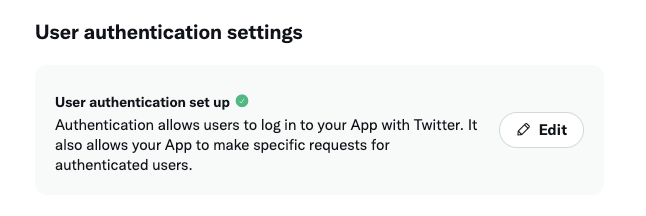
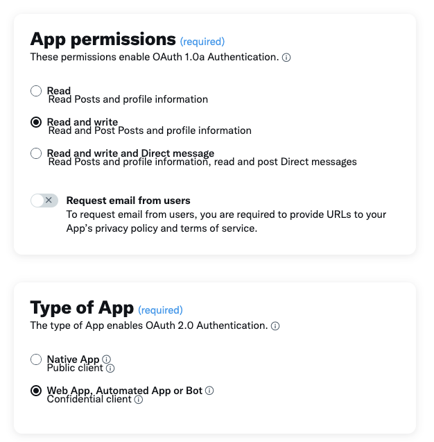
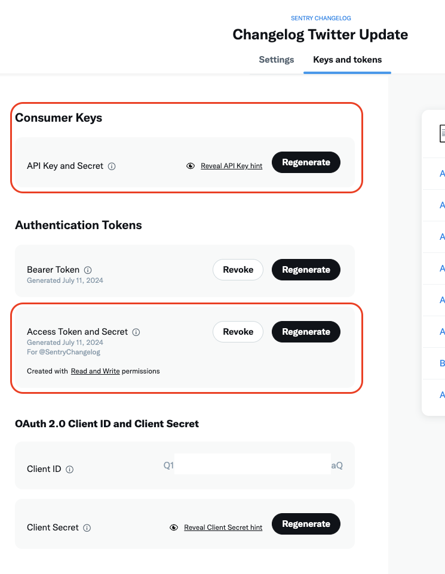
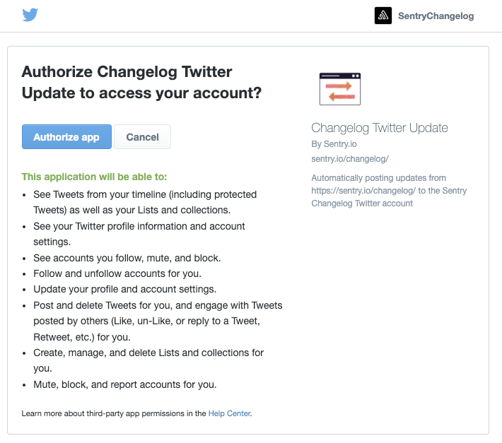

# incident-twitter-bot
 
This is a GCP Cloud Function that subscirbed to [Sentry Statuspage](https://status.sentry.io/) and post the incident updates on the [Sentry Support Twitter Account](https://x.com/getsentryhelp)

# Backstory
<details>
    <summary>Why are we doing this</summary>

As part of the cookieless project, we noticed that twitter related cookies are dropped on the status.sentry.io page. After some investigation, we identified that it was dropped by the Twitter embedded from the Subscribe to Updates feature.

We tried to use the custom JavaScript and CSS feature in Statuspage to remove the Twitter embedded, but was only able to remove it after the script was dropped but not before, in which Twitter cookies are still dropped on our statuspage. We also reached out Atlassian support team on this, but we were only offered with a feature request but no real solution.

To remove the Twitter cookies and tracker, but also retain the functionality to share updates to Twitter, we decide to build something in house that rely on webhook and Google Cloud Function to deliver the feature.
</details>


# How it works

This repo defines the infrasturtre and required components for a GCP cloud functions that listens to webhooks and post the data to Twitter. The intention is to update our Sentry Support Twitter account with incidents that are posted on [Sentry Statuspage](https://status.sentry.io/)

# Setup

## GCP
The infrasturce lives in the `incident-twitter-bot` GCP project, you can deploy the infrasturce using terraform. You will need to be authenticated to GCP with an account that has access to the project in your command line.

```
cd terraform
terraform init
terraform plan
terraform apply
```
Once the infra is deployed, you will need to update the following secrets in GCP Secret Manager.
```
getsentryhelp_twitter_consumer_key
getsentryhelp_twitter_consumer_secret
getsentryhelp_twitter_access_token
getsentryhelp_twitter_access_token_secret
```
The twitter ones can be retrieved in the Twitter section below.

`sentry_atlassian_status_page_id` is hardcoded in the code, which can be retrieve from your Statuspage manage page: https://manage.statuspage.io/pages/YOUR_PAGE_ID_HERE/incidents

## Twitter

> Free version of Twitter API access is sufficiant for this integration.

You can visit [Twitter Developer Portal](https://developer.twitter.com/en/portal/projects-and-apps) to create a Free App for your Twitter account.

Once the app is created, edit the `User authentication settings`


Update the `App permissions` to `Read and write`, select `Web App, Automated App or Bot` as Type of App


For the App info, you can enter any URI for the required field, as we won't need them in the future. Don't forget to click save when you are done.

Next, go to the `Keys and tokens` tab, can create the Key/Secret pair for both `Consumer Keys` and `Acess Token and Secret`.


These are the keys that need to be added to the GCP secret manager, please handle them securely as anyone who has access to these keys will have access to your Twitter account.

Before these key has actual access to your Twitter account, we need to go through the OAuth flow. You can use the [sample code provided by Twitter](https://github.com/xdevplatform/Twitter-API-v2-sample-code/blob/main/Manage-Tweets/create_tweet.py), remember to set the environment variables as the consumer key and secret we generated in the last step. 

While running the script, you will be asked to visit an OAuth URL and authorize the app's access to your account. After authorizing, the script will try to post a "Hello world" twitter to your account, you can use this to verify the authorization is completed successfully.


Once this is completed, update the secrets in GCP and you should be good to go!

## Inputs - Webhook from Statuspage

Atlassian Documents regarding webhooks: 

https://support.atlassian.com/statuspage/docs/enable-webhook-notifications/

<details> 
    <summary> Example Incident Webhook</summary>
    
    {
       "meta":{
          "unsubscribe":"http://statustest.flyingkleinbrothers.com:5000/?unsubscribe=j0vqr9kl3513",
          "documentation":"http://doers.statuspage.io/customer-notifications/webhooks/"
       },
       "page":{
          "id": "j2mfxwj97wnj",
          "status_indicator": "high",
          "status_description": "Major System Outage"
       },
       "incident":{
          "backfilled":false,
          "created_at":"2013-05-29T15:08:51-06:00",
          "impact":"high",
          "impact_override":null,
          "monitoring_at":"2013-05-29T16:07:53-06:00",
          "postmortem_body":null,
          "postmortem_body_last_updated_at":null,
          "postmortem_ignored":false,
          "postmortem_notified_subscribers":false,
          "postmortem_notified_twitter":false,
          "postmortem_published_at":null,
          "resolved_at":null,
          "scheduled_auto_transition":false,
          "scheduled_for":null,
          "scheduled_remind_prior":false,
          "scheduled_reminded_at":null,
          "scheduled_until":null,
          "shortlink":"https://status.sentry.io/incidents/bt27tt1h1wsd?u=jwjgrfrf3pjj",
          "status":"monitoring",
          "updated_at":"2013-05-29T16:30:35-06:00",
          "id":"lbkhbwn21v5q",
          "organization_id":"j2mfxwj97wnj",
          "incident_updates":[
             {
                "body":"A fix has been implemented and we are monitoring the results.",
                "created_at":"2013-05-29T16:07:53-06:00",
                "display_at":"2013-05-29T16:07:53-06:00",
                "status":"monitoring",
                "twitter_updated_at":null,
                "updated_at":"2013-05-29T16:09:09-06:00",
                "wants_twitter_update":false,
                "id":"drfcwbnpxnr6",
                "incident_id":"lbkhbwn21v5q"
             },
             {
                "body":"We are waiting for the cloud to come back online and will update when we have further information",
                "created_at":"2013-05-29T15:18:51-06:00",
                "display_at":"2013-05-29T15:18:51-06:00",
                "status":"identified",
                "twitter_updated_at":null,
                "updated_at":"2013-05-29T15:28:51-06:00",
                "wants_twitter_update":false,
                "id":"2rryghr4qgrh",
                "incident_id":"lbkhbwn21v5q"
             },
             {
                "body":"The cloud, located in Norther Virginia, has once again gone the way of the dodo.",
                "created_at":"2013-05-29T15:08:51-06:00",
                "display_at":"2013-05-29T15:08:51-06:00",
                "status":"investigating",
                "twitter_updated_at":null,
                "updated_at":"2013-05-29T15:28:51-06:00",
                "wants_twitter_update":false,
                "id":"qbbsfhy5s9kk",
                "incident_id":"lbkhbwn21v5q"
             }
          ],
          "name":"Virginia Is Down"
       }
    }
</details>
    
<details> 
    <summary>Example Component update Webhook</summary>
    
    {
       "meta":{
          "unsubscribe":"http://statustest.flyingkleinbrothers.com:5000/?unsubscribe=j0vqr9kl3513",
          "documentation":"http://doers.statuspage.io/customer-notifications/webhooks/"
       },
       "page":{
          "id": "j2mfxwj97wnj",
          "status_indicator": "major",
          "status_description": "Partial System Outage"
       },
       "component_update":{
          "created_at":"2013-05-29T21:32:28Z",
          "new_status":"operational",
          "old_status":"major_outage",
          "id":"k7730b5v92bv",
          "component_id":"rb5wq1dczvbm"
       },
       "component":{
          "created_at":"2013-05-29T21:32:28Z",
          "id":"rb5wq1dczvbm",
          "name":"Some Component",
          "status":"operational"
       }
    }
</details>


> 💡 The webhook is signed up using `support@sentry.io`, any notifications will be delivered to this mailbox

## Outputs

If the request is a valid request originated from Atlassian Statuspage, the function will always return a 200 success to ensure it does not get treated as dead webhook, otherwise it will be deactivated in Atlassian Statuspage.

Webhook request will be ignored if any of the following is true

- Request source IP is not in [https://ip-ranges.atlassian.com](https://ip-ranges.atlassian.com/)
- Required fields are not found in the request body
- Page ID in the request is not our page ID
- No `incident` component in the request

If an incident component is found in the webhook request, a post will be posted to twitter with the following format:
```
[status] `incident_status`: `incident_update`  `link_to_incident`
```